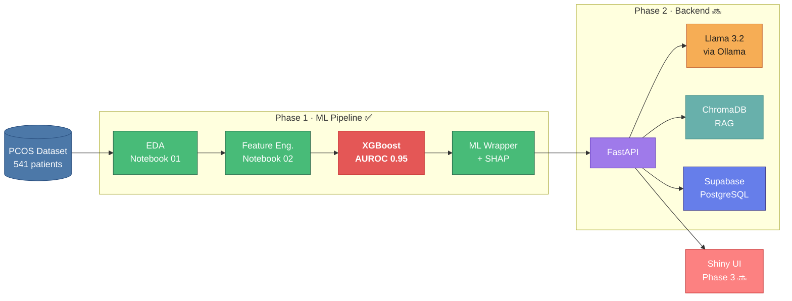

# PCOSense: Multi-Agent System for Polycystic Ovary Syndrome Detection

> AI-powered screening tool for Polycystic Ovary Syndrome (PCOS) using a multi-agent architecture, local LLM, and explainable ML.

---

## Overview

PCOSense is a full-stack clinical decision-support application that helps identify early PCOS risk from patient biomarkers. It combines:

- **XGBoost ML model** trained on 541 labeled patient records — **AUROC 0.9528** ✅
- **SHAP explainability** — shows which biomarkers drive each individual prediction
- **Ollama + Llama 3.2** (local LLM via Ollama) — zero API cost, runs entirely on your machine
- **Multi-agent RAG system** — retrieves relevant medical literature in real time
- **Python Shiny frontend** — interactive, modern clinical UI
- **FastAPI backend** — clean REST endpoints connecting all components
- **Supabase** — patient session storage and history

---

## Tech Stack

| Layer | Technology |
|-------|-----------|
| Frontend | Python Shiny |
| Backend | FastAPI + Uvicorn |
| ML Model | XGBoost + SHAP |
| LLM | Ollama · Llama 3.2 (local) |
| Vector DB | ChromaDB (RAG) |
| Database | Supabase (PostgreSQL) |
| Data | Kaggle PCOS Dataset (541 records, 45 features) |

---

## System Architecture



---

## ML Model Results

| Metric | Value |
|--------|-------|
| Algorithm | XGBoost Classifier |
| Dataset | 541 patients · 45 raw features |
| Engineered features | 42 (incl. LH/FSH ratio, HOMA-IR, follicle composites) |
| Training samples | 432 (80% stratified split) |
| Test samples | 109 (20% stratified split) |
| **AUROC** | **0.9528 ✅** |
| Explainability | SHAP TreeExplainer |
| Threshold | Youden's J statistic |
| Inference time | < 50 ms per patient |

**Top predictive features (by SHAP):**
- Morphological: follicle count L/R, follicle total, ovarian volume
- Hormonal: LH/FSH ratio, AMH, testosterone
- Metabolic: BMI, insulin resistance (HOMA-IR proxy)
- Symptoms: skin darkening, hair growth, weight gain, acne
- Cycle: length, regularity

---

## Project Structure

```
PCOSense/
├── notebooks/
│   ├── 01_eda.ipynb                  ✅ EDA — distributions, correlations
│   ├── 02_features.ipynb             ✅ Feature engineering — 42 features
│   └── 03_xgboost_training.ipynb     ✅ Training — AUROC 0.9528
├── src/
│   ├── ml_model.py                   ✅ Prediction wrapper + SHAP explainer
│   ├── agents/                       🔜 Multi-agent system (Phase 2)
│   ├── api/                          🔜 FastAPI routes (Phase 2)
│   └── app/                          🔜 Shiny frontend (Phase 3)
├── models/
│   ├── pcos_model.json               ✅ Trained XGBoost model (524 KB)
│   └── model_metadata.json           ✅ AUROC, features, SHAP rankings
├── data/
│   ├── raw/                          ✅ PCOS_data_without_infertility.xlsx
│   └── processed/
│       ├── features_processed.pkl    ✅ Train/test splits + scaler + imputer
│       └── eda_meta.json             ✅ EDA summary metadata
├── requirements.txt
└── .gitignore
```

---

## Quickstart

### Prerequisites

- Python 3.12
- [Kaggle API token](https://www.kaggle.com/settings) (for initial data download only)

### 1 — Clone & set up environment

```bash
git clone <repo-url>
cd PCOSense

python3.12 -m venv .venv
source .venv/bin/activate        # Windows: .venv\Scripts\activate

pip install --upgrade pip
pip install -r requirements.txt
```

### 2 — Configure Kaggle credentials (one time only)

```bash
mkdir -p ~/.kaggle
echo '{"username":"YOUR_USERNAME","key":"YOUR_KEY"}' > ~/.kaggle/kaggle.json
chmod 600 ~/.kaggle/kaggle.json
```

Get your token at [kaggle.com/settings](https://www.kaggle.com/settings) → API → Create New Token.

### 3 — Train the model (run notebooks in order)

```bash
jupyter notebook
```

Open and run each notebook in order:

1. `notebooks/01_eda.ipynb` — downloads data, explores distributions
2. `notebooks/02_features.ipynb` — cleans, engineers, and normalises features
3. `notebooks/03_xgboost_training.ipynb` — trains model, saves `models/pcos_model.json`

> **Note:** The trained model is committed to the repo — others do not need to re-run these notebooks.

### 4 — Verify the ML wrapper

```bash
python src/ml_model.py
```

Expected output: AUROC, risk score, top SHAP risk factors, and a plain-English explanation.

---

## Development Phases

- [x] **Phase 1** — XGBoost ML model (AUROC 0.9528) + SHAP explainability ✅
- [ ] **Phase 2** — Ollama Mistral LLM + ChromaDB RAG + multi-agent system + FastAPI
- [ ] **Phase 3** — Python Shiny frontend + Supabase integration + full deployment

---

## Important Notes

- `kaggle.json` is **never committed** — only needed locally to download the raw data
- `models/pcos_model.json` is committed — the app loads this at runtime, no retraining needed
- All LLM inference runs locally via Ollama — **zero API costs**
- The app is designed to run fully offline after initial setup
